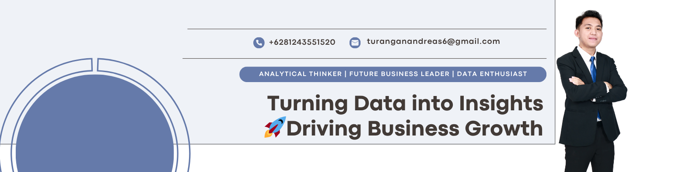

## Hi there 👋

💻 Informatics Engineering graduate | Passionate about Data Analyst & Machine Learning  
📊 Exploring insights through Python, SQL, and ML models  
🚀 Actively building projects in NLP, Computer Vision & Business Analytics  
🎓 Computer Science at Sam Ratulangi University | Part of Pertukaran Mahasiswa Merdeka | Machine Learning Cohort Bangkit Academy
📫 Let's connect: [LinkedIn](https://www.linkedin.com/in/andreasturangan/)

___
# 💻 Tech Stack:
              
___
# ✨Data Visualization
   

___
# 📊 GitHub Stats:

 

---

# 🧠 Daily Inspiration  

